##Overview
Manoa Eats is a web application that allows anyone to access information about different eateries on the University of Hawaii of Manoa campus. 
Manoa Eats seeks to provide a clean and simple interface to show users which restaurants are currently open around them. The app also randomly pairs
indecisive individuals to find a new restaurant that matches their specific diets. The app also allows vendors to create and manage a profile of their restaurants. 
The application also includes in depth UI testing to make sure that hungry students will always have access to a collection of restaurants around the campus.

##Contributions
Sign in/Sign up Page:
Implemented a way for users to sign up as either a vendor, or a user
 
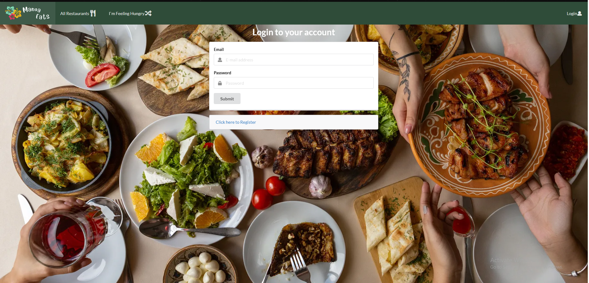
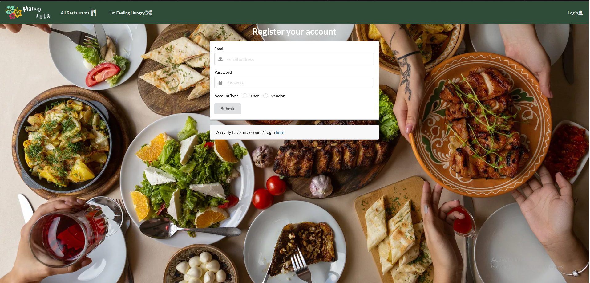
 
Vendor Page:
Used ReactJS and publish and subscription to get information about a vendors menu and display reviews from multiple users
 
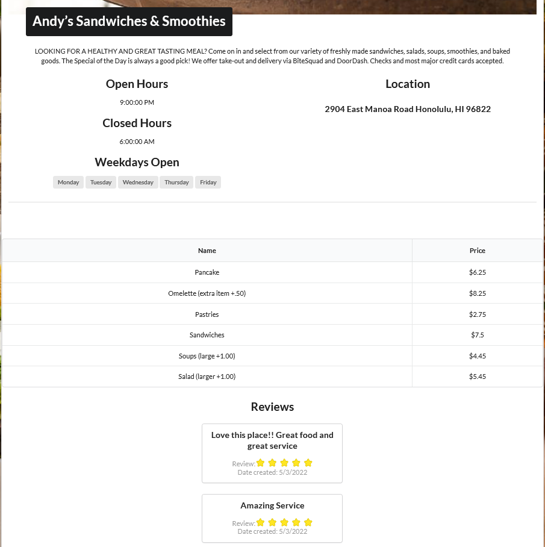
 
Landing Page: 
Created card for open now sections. Implemented a way to show currently open restaurants based on users time.
 
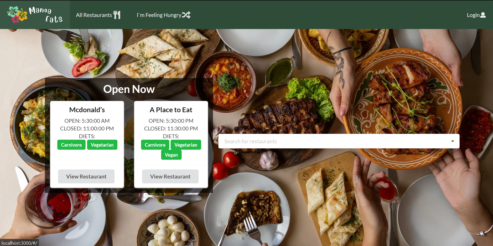
 
I'm Feeling Hungry Page: 
Created an algorithm which efficiently matches users to restaurants that match their preferred diet, also got random restaurant cards to show up when clicking on the link.
 
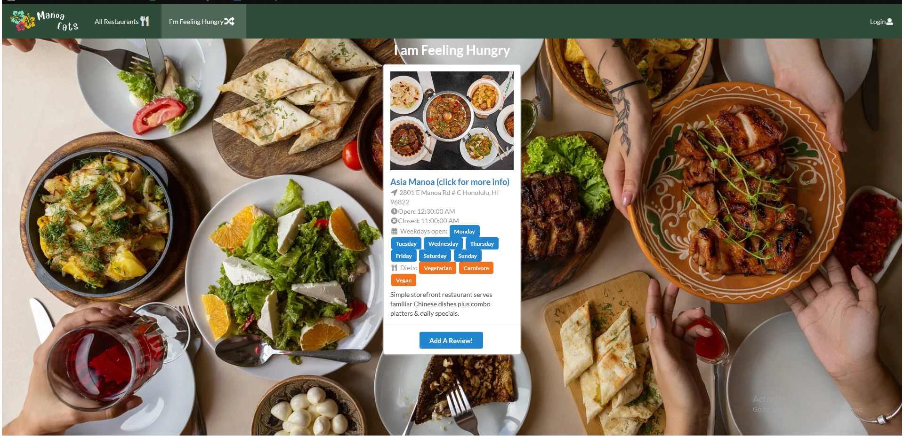
 
Create Profile:
Created database for user profiles
Designed and implemented a page to write to a mongodb database information about a users foods, name, diets, and a profile picture
 
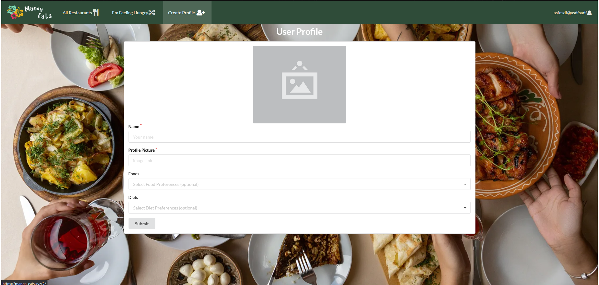
 
Edit Profile:
Designed and implemented a page to read information to a mongodb database and to update accordingly based on user changes
 
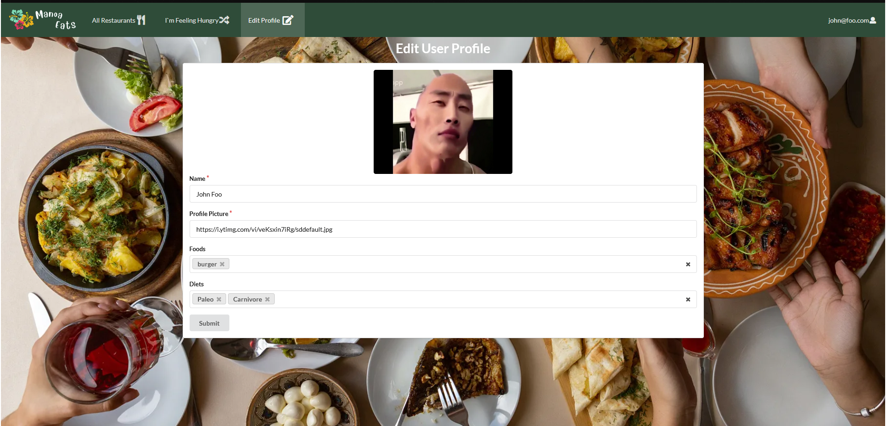
 
Vendor Profile:
Created database for vendors
Designed and implemented a page to write to a mongodb database information about a vendors business name, diets, open/close times, profile image, description, and weekdays open
 
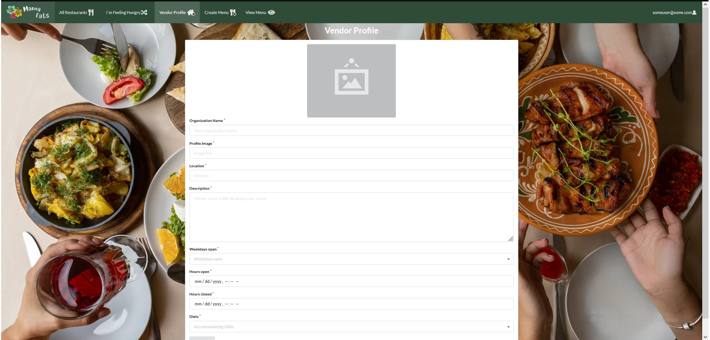
 
Edit Vendor Profile:
Designed and implemented a page to read and update a mongodb database about a vendors business name, diets, open/close times, profile image, description, and weekdays open
 
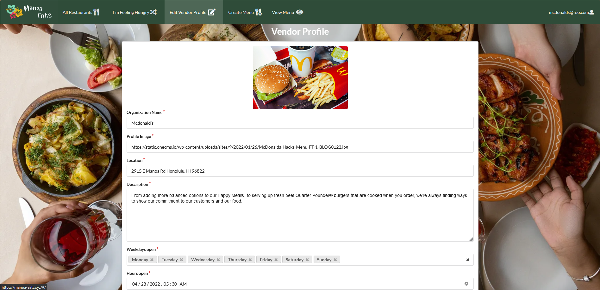
 
Create Menu: 
Designed and implemented a page to write to a mongodb database information about a vendors menu items
 

 
View Menu:
Designed and implemented a page to read menu data given by users
 
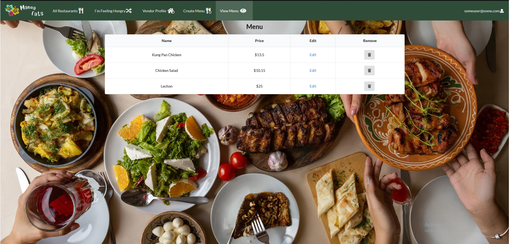
 
Vendor Verification:
Implemented the remove button which allows an admin to remove a vendor from the mongodb database
 
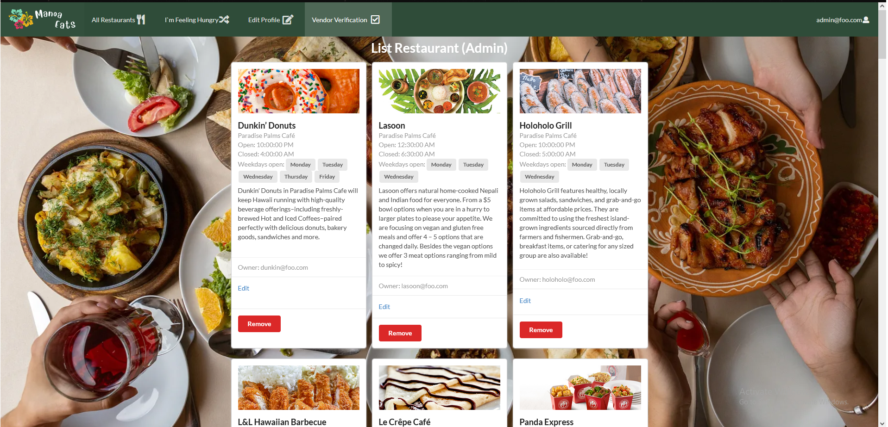
 

Design:
I contributed to the initial mockups of the signin/signup page. I also contributed to adding icons throughout our project which significantly improved 
the look of our application, allowing users to quickly associate icons with corresponding text.

##I am the impostor
In high school I was on the paddling team, but I never felt like I belonged on the team, I wasn't some macho 6"+ Hawaiian guy or some buff football player, in fact I was the 
opposite, I was a scrawny, unathletic kid who couldn't swim and never touched a paddle before! So I thought to myself there was no hope I was even going to make it onto the starting crew, 
but after tryouts I found, so it was to my surprise when I learned I made the starting crew. On my first practice in the water my coach pulled me aside 
and told me to "You don't need to paddle so hard". This would seem like the opposite of something a coach would typically say, 
but he knew that I sat in the first seat of the boat which sets the pace and if I gas out then the entire boat slows down overall. He knew that I didn't 
feel like I belonged in the starting crew and so to help me he told me to trust in my teammates and reassured me why I belonged in the starting crew. 
I bring up this story because when I first began this project I didn't feel like I could call myself a programmer
let alone a software engineer. I had no cool internship at some prestigious company, or some really intricate program that finds and buys stock. All I had were some dinky 
programs that would often time break. To compensate for this I did exactly what I did in paddling I worked harder to prove to myself that I belonged here just like everyone else, I 
worked on as many tasks as I could and tried to work on every single issue. For this project unfortunately I did not have someone to pull me over and tell me what I needed to hear. However, 
it showed me that I can call myself a software engineer throughout this project I proved to myself throughout implementing countless features and pages that I am capable of making an amazing website and this project has definitely allowed me to realize that 
I want to become a software engineer and that I am cut out for this field.
##Conclusions
This was my first time working on a large project from start to finish. I learned a lot about the type of person that I am, and I even learned 
more about the type of people that I enjoy working with. I think the hardest task in terms of programming was trying to get the menus to show up on the vendor page
since vendors need to see their own menu, but the menu database needs to be able to be accessed without an owner. To get around this I created a special link which uses 
a vendors' username in order to retrieve specific info about a vendors menus. Another programming challenge was definitely messing with getting our filtering feature on the landing page 
to work the logic behind that was much more complicated than I had anticipated and messing with time was a challenge in it of itself. As for the project I would say working with a 
team that I had barely known was a real challenge and ultimately was the most difficult part of this project. Another challenge was collaborating with 
GitHub and git as some members on the team had no prior experience of what is like working with these two tools with a group. As such there were expected, 
but minimal merge conflicts throughout the project. Overall, I would say that this project has definetly helped me improve my coding abilities and become confident in programming 
large projects.

You can learn more about the project at our github page found here => <a href="https://github.com/manoa-eats/manoa-eats"><i class="large github icon"></i>devgav/manoa-eats</a>
or 
Check out our github.io page here => <a href="https://manoa-eats.github.io/"><i class="large github icon"></i>manoa-eats.github.io</a>